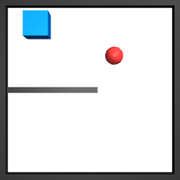
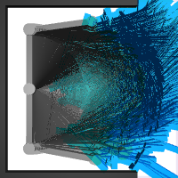

# ge_world

The name is just a placeholder b/c I didn't have a better name. ge_ is the namespace for this package.

## To Develop

All research python modules need to have a proper `setup.py` file that installs the module. 

To start using this module, install this code in evaluation
mode by
```bash
cd ge_wold
pip install -e .
```

Now you should be able to import the module, and evaluate with 
updated code when it changes.


## Environments

Right now all environments are continuous. As we discussed, we might want to change the action to discrete action at some point to make it easy to use Q learning.

### Newer Environments

#### GoalMass

- [ ] add all envs


#### C-Maze



This is a maze navigation environment with a wall in the middle, separating the space into two rooms.

#### Peg Insertion (2D)

We make the `"img"` and `"goal_img"` ignore the slot, so that the ConvNet can focus on the position of the sword itself. 

In a future work, we can have the robot learn to disentangle these components. (shouldn't be too hard.)

use `"a"` key to access the raw, continuous action.

| key        | "Free" | Regular |
| ---------- | ------ | ------- |
| "human"    |  |  |
| "img"      |  |  |
| "goal_img" |  |  |

The initial state is distributed as such:



---

### Older ones

#### PointMass

the state space it returns is 

```python
[x, y, x_dot, y_dot, goal_x, goal_y]
```

#### Inverted Pendulum

We avoid the name `Pendulum-v0` b/c there is already a gym 
environment with the same name.

The state space it returns is 
```python
[cos(theta), sin(theta), theta_dot]
```
The reward is the angular difference between the current
angle theta, and the upright position.

#### CartPole

- [ ] Still under construction
